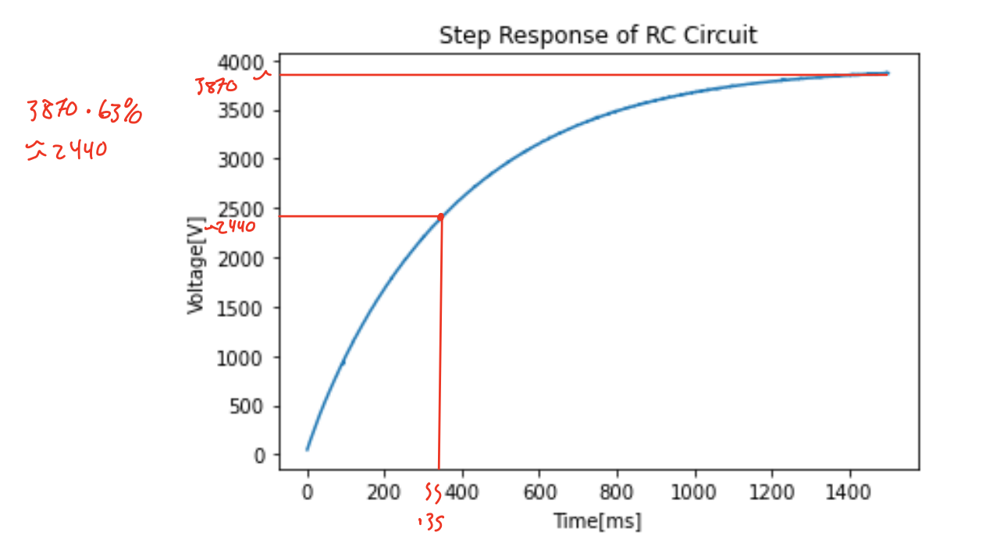
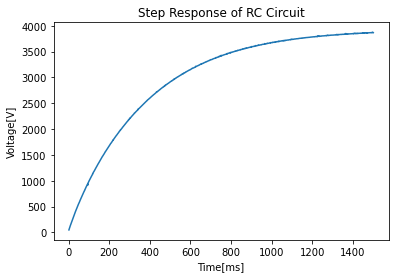

# Lab-4_Ruiz_Martos
## **Step Response Test of RC Circuit**
 Using the RC circuit provided to us, we created an Interrupt service routine to measure the ADC value of an RC circuit with a time constant of around 0.3s. To do this we set a pin as an enable to the circuit and one to be an analog to digital converter. This allows us to read the first-order circuit response using an interupt at a rate of 1000 Hz. In this interrupt, it stores time and voltage values in a queue to be printed. Our system consisted of a resistor of 102.9 kOhms and a 3.35 microFarad Capacitor. The Calculated time constant RC is 0.3447 Seconds. The output of our measured Repsonse is shown below. We found that at around ~350 ms from the plot and 354 ms from data combing was when our plot reached 63% of the max Voltage.
## **Results**

